# ExtBridge `v3.5.4` 对比 `v3.2` 全量更新图文介绍与底层激活逻辑详解

> 本文档完整汇总 **ExtBridge 从 `v3.2.x` 演进至 `v3.5.4` (`versionCode: 26`)** 的全部新增功能、Miuix 澎湃界面重构、底层三模激活架构与安全加固。所有 App 内界面实抓自 **REDMI K Pad (`1880×3008`)**，所有外接屏画面均通过 **硬件 HDMI 采集卡 (`USB3 PLUS Video · 1920×1080@60fps`)** 直接抓取真实物理输出信号。

---

## 一、`v3.2` → `v3.5.4` 核心演进总表

| 功能维度 | `v3.2.x` 基线状态 | `v3.5.4` 全新状态（新增 / 重构） |
| :--- | :--- | :--- |
| **App 主控台视觉与交互** | 传统 Android 原生单页滚动堆砌、彩虹色按钮、无深浅色切换 | **`Jetpack Compose + Miuix 0.9.4` 澎湃原生重构**：4 大板块分页、澎湃深色/浅色/跟随系统三态切换、手机底栏 `NavigationBar` 与平板横屏左侧 `NavigationRail` 双栏工作台自适应 |
| **外接屏周边 UI 体系** | 混用字符 Emoji、直角旧弹窗 | **全周边线性矢量图标统一（零 Emoji）**：自研 `HyperUi` 抗锯齿矢量绘制引擎，统一澎湃毛玻璃 Dock、`#0D84FF` 控制中心浮窗、桌面右键菜单与分屏气泡 |
| **多任务与窗口动效** | 仅单窗口全屏切换，无分屏与过渡动画 | **DeX 自由分屏（横屏左右 / 竖屏上下，`25%~75%` 拖拽 + 快捷比例菜单）** + **HyperOS 2.0 级 `StageTransitionView` 零拷贝 `HardwareBuffer` 窗口缩放/交叉过渡动画** + **Dock 闲置 `2.6s` 自动隐藏** |
| **原生镜像模式** | 仅纯黑边简单投射，外置鼠标无法在副屏显示或跨入黑边 | **重塑为「增强信息副屏 + 系统 `AppWidget` 工作台」**：4 种对齐合并布局、6 款主题换肤、14 款可交互信息卡片、第三方桌面小组件 5 档比例防拉伸、物理鼠标无缝跨屏 + 无键鼠主屏 **「副屏直控」** |
| **主屏护眼与省电** | 外接时主屏常亮耗电 | **主屏「一键黑屏」**：4 处入口一键将主屏压至硬件最低亮度 `1` 并叠加防误触黑幕，外接 HDMI 保持 100% 满亮，双击内屏或拔线自动精确恢复原亮度 |
| **大触摸板与跨屏输入** | 基础触控面板，右键/返回偶发失效 | **Miuix 重构大触摸板**：实时坐标顶栏、拖拽锁定、5 档倍速、底部一键黑屏/副屏直控快捷栏、含 `Ctrl+A/C/V` 与方向键的软键盘跨屏文字直达弹层 |
| **外接比例与系统兼容** | 易被小米「工作台模式」劫持为无法拖动的 `•••` 悬浮小窗 | **全链路防小窗劫持保护**（锁定扩展屏 `FULLSCREEN` 容器） + 原生适配 **`3440×1440` / `2560×1080` (`21:9` 带鱼屏)** EDID 智能优选 |
| **激活可靠性与安全架构** | 固定 `15037` TCP 端口、导出组件无签名校验、小米手机偶发 `ERR_STAGE_JAR`、Root 偶发握手超时 | **私有 `0700` Unix Socket + 无线调试三级 `adb push` 免 `unzip` 管线 + Root `<250ms` 独立线程 `u:r:shell:s0` 降权双通道握手 + 官方 X.509 证书 SHA-256 双向鉴权** |

---

## 二、App 内 `Miuix 0.9.4` 澎湃界面切换、浅深主题与横竖屏自适应

### 1. 四大核心分页切换（`控制台 · 显示与边栏 · 应用规则 · 设置`）

| Tab 1 · 控制台首页（澎湃深色） | Tab 2 · 显示与边栏（DeX 画布与吸附 DPI） | Tab 2 · 显示与边栏（镜像 2×2 可视化布局） |
| :---: | :---: | :---: |
| 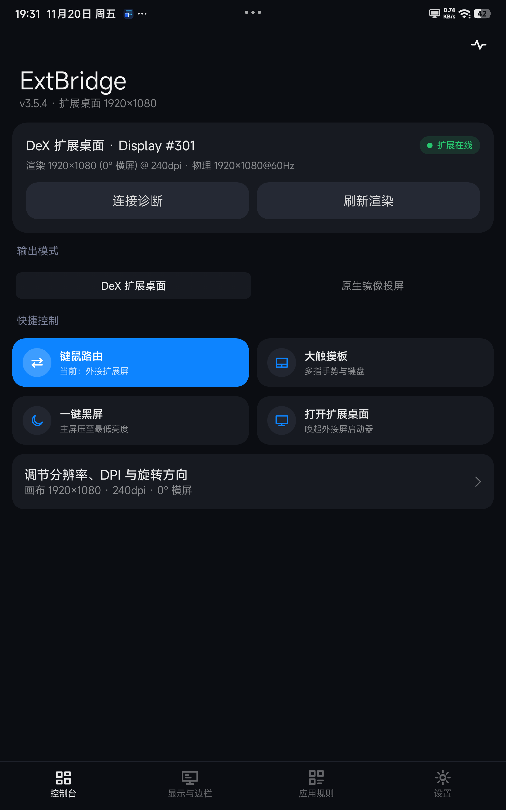 | 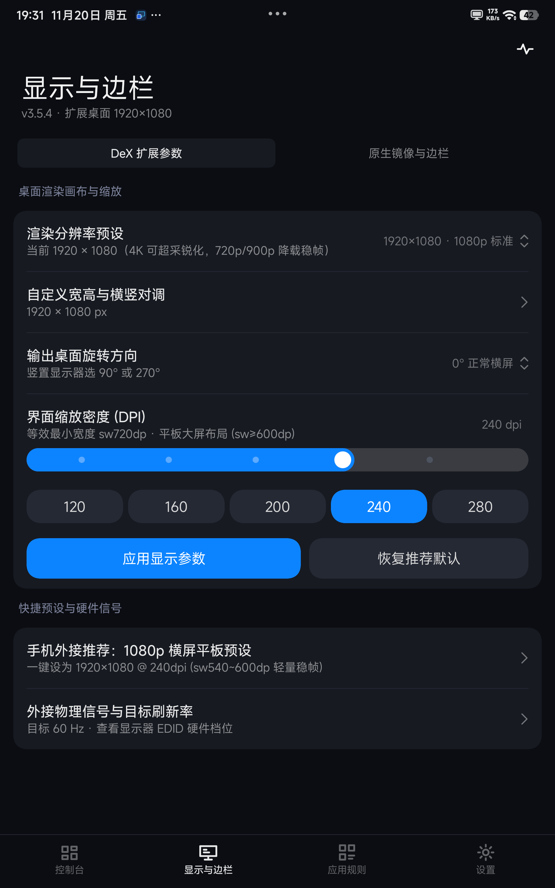 | 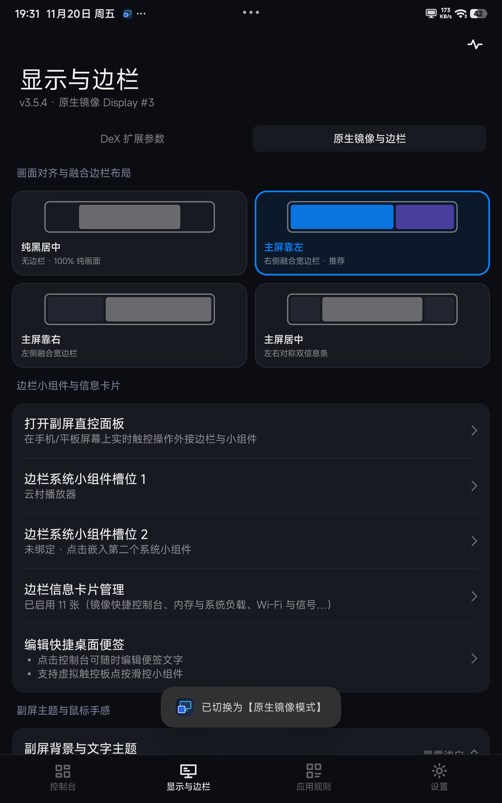 |

| Tab 3 · 分应用显示规则搜索与置顶页 | Tab 4 · 设置与服务页 | Miuix 抽屉 · 连接诊断 / 14 款卡片管理 |
| :---: | :---: | :---: |
| 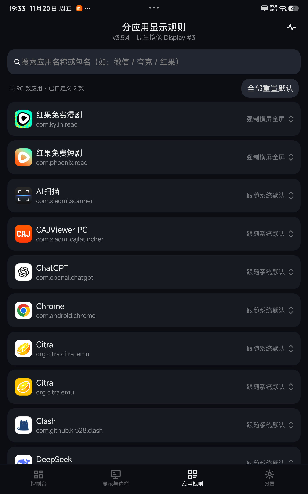 | 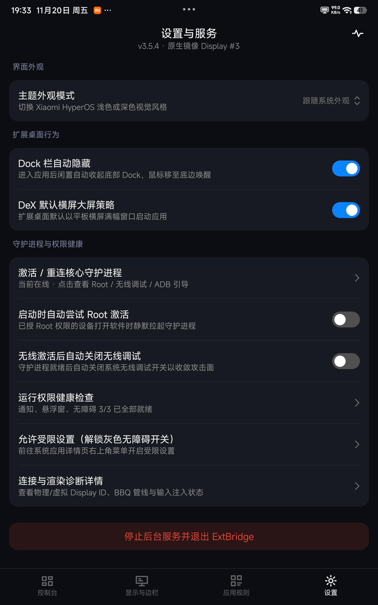 | 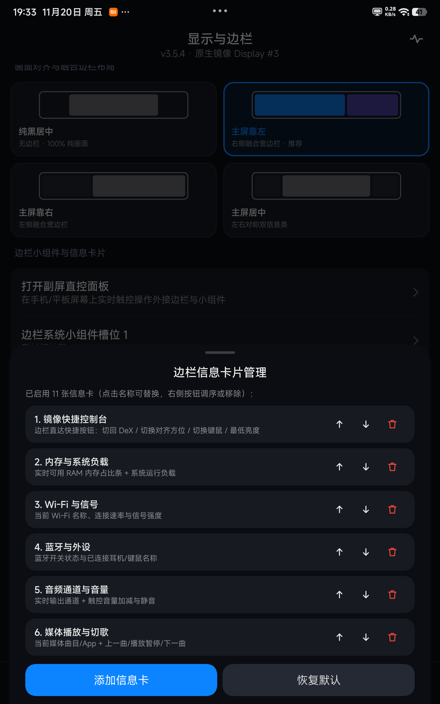 |

### 2. 澎湃深色 / 浅色三态切换 & 平板横屏 `NavigationRail` 双栏工作台

- **三态外观实时切换**：支持 `跟随系统外观`、`澎湃浅色模式`、`澎湃深色模式`，系统状态栏与手势条反色实时联动。
- **响应式宽屏布局**：屏幕宽度 `>= 760dp`（如平板横屏）时自动由底部 `NavigationBar` 切换为 **左侧 `NavigationRail` 导轨 + 双栏并排工作台**。

| 外观三态下拉菜单 (`SuperDropdown`) | 竖屏 · 澎湃浅色模式首页 | 连接与渲染管线诊断抽屉 |
| :---: | :---: | :---: |
| 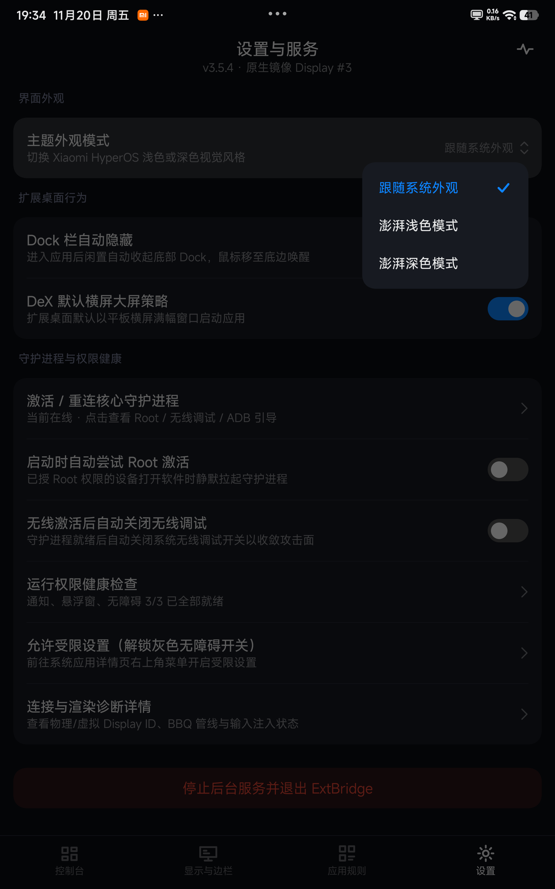 | 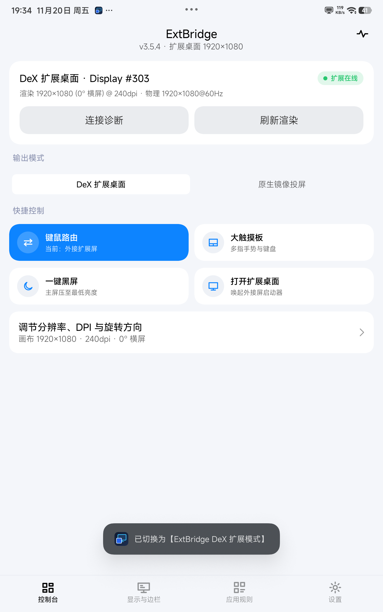 | 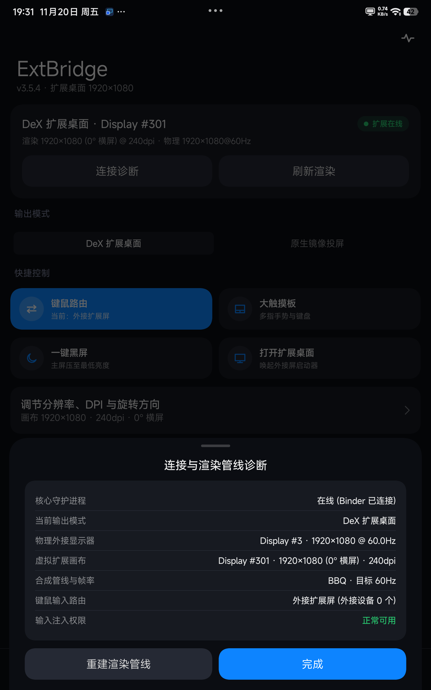 |

| 平板横屏 `NavigationRail` 双栏工作台（浅色） | 平板横屏 `NavigationRail` 双栏工作台（深色） |
| :---: | :---: |
| 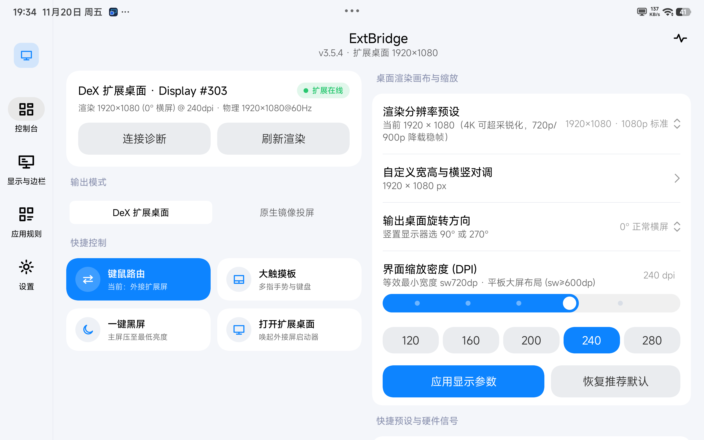 | 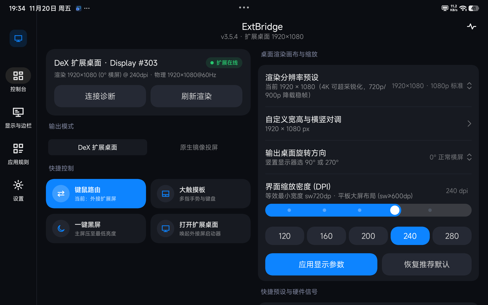 |

---

## 三、三模高可靠激活界面与底层完整激活逻辑详解

未激活状态下，首页状态卡自动切换为引导态并在右上角提供闪电快捷入口；激活抽屉内含 **「无线调试 · Root 激活 · 电脑 ADB」** 三大标签页，后台完成 Binder 握手瞬间自动收起抽屉进入在线工作态。

| 未激活态首页引导卡 | 方式 A · 免 Root 本机无线调试 | 方式 B · Root 一键降权激活 | 方式 C · 电脑 ADB 跨平台命令 |
| :---: | :---: | :---: | :---: |
| 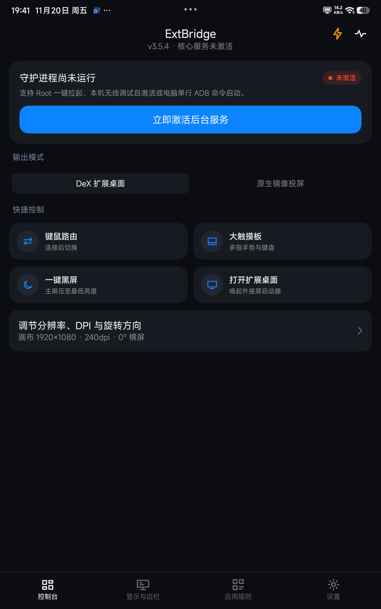 | 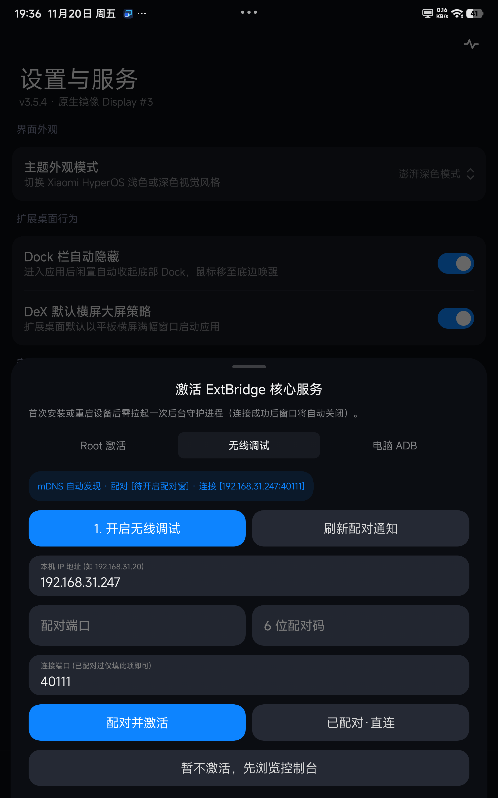 | 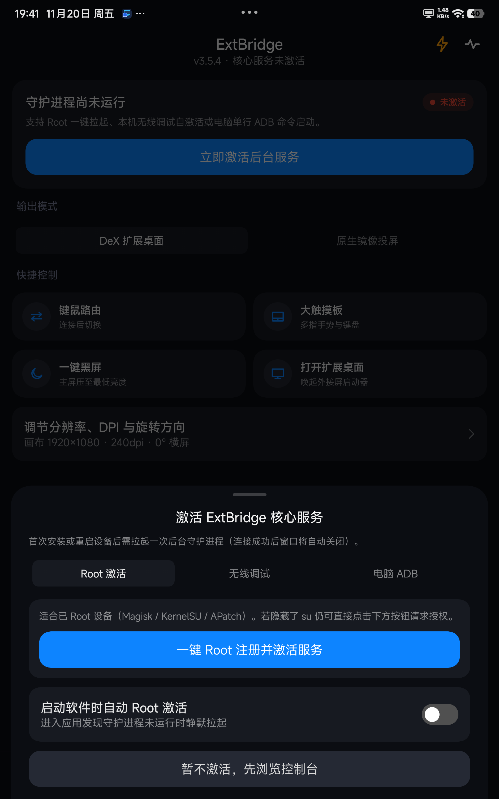 | 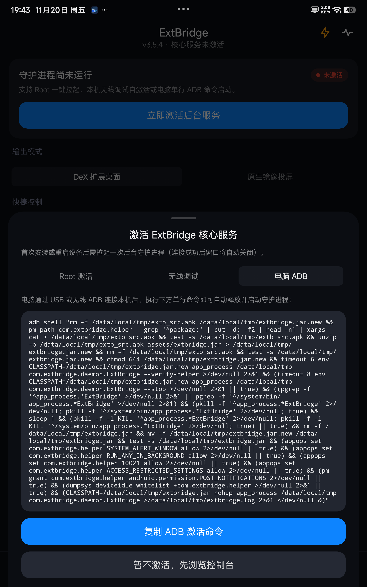 |

### 底层激活与双向鉴权全链路时序图

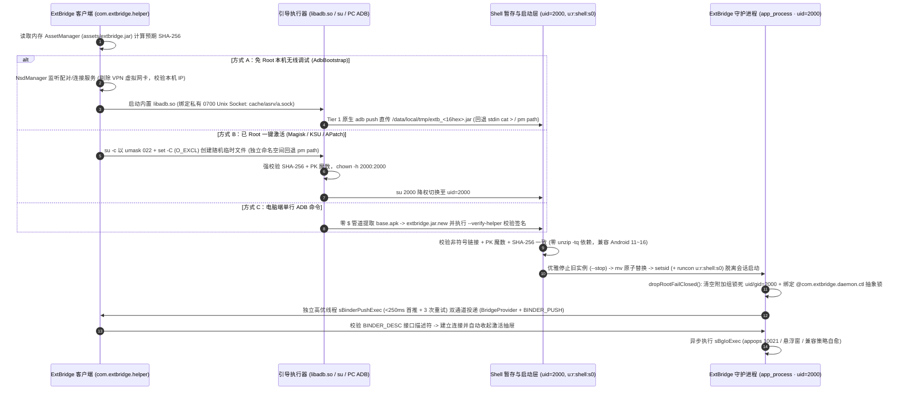
```mermaid
sequenceDiagram
    autonumber
    participant UI as ExtBridge 客户端 (com.extbridge.helper)
    participant Boot as 引导执行器 (libadb.so / su / PC ADB)
    participant Shell as Shell 暂存与启动层 (uid=2000, u:r:shell:s0)
    participant Daemon as ExtBridge 守护进程 (app_process · uid=2000)

    UI->>UI: 读取内存 AssetManager (assets/extbridge.jar) 计算预期 SHA-256
    alt 方式 A：免 Root 本机无线调试 (AdbBootstrap)
        UI->>UI: NsdManager 监听配对/连接服务 (剔除 VPN 虚拟网卡，校验本机 IP)
        UI->>Boot: 启动内置 libadb.so (绑定私有 0700 Unix Socket: cache/asrv/a.sock)
        Boot->>Shell: Tier 1 原生 adb push 直传 /data/local/tmp/extb_<16hex>.jar (回退 stdin cat > / pm path)
    else 方式 B：已 Root 一键激活 (Magisk / KSU / APatch)
        UI->>Boot: su -c 以 umask 022 + set -C (O_EXCL) 创建随机临时文件 (独立命名空间回退 pm path)
        Boot->>Boot: 强校验 SHA-256 + PK 魔数，chown -h 2000:2000
        Boot->>Shell: su 2000 降权切换至 uid=2000
    else 方式 C：电脑端单行 ADB 命令
        Boot->>Shell: 零 $ 管道提取 base.apk -> extbridge.jar.new 并执行 --verify-helper 校验签名
    end

    Shell->>Shell: 校验非符号链接 + PK 魔数 + SHA-256 一致 (零 unzip -tq 依赖，兼容 Android 11~16)
    Shell->>Daemon: 优雅停止旧实例 (--stop) -> mv 原子替换 -> setsid (+ runcon u:r:shell:s0) 脱离会话启动
    Daemon->>Daemon: dropRootFailClosed(): 清空附加组锁死 uid/gid=2000 + 绑定 @com.extbridge.daemon.ctl 抽象锁
    Daemon->>UI: 独立高优线程 sBinderPushExec (<250ms 首推 + 3 次重试) 双通道投递 (BridgeProvider + BINDER_PUSH)
    UI->>Daemon: 校验 BINDER_DESC 接口描述符 -> 建立连接并自动收起激活抽屉
    Daemon->>Daemon: 异步执行 sBgIoExec (appops 10021 / 悬浮窗 / 兼容策略自愈)
```

### 核心激活设计要点
1. **免 Root 无线调试（三级免 `unzip` 直传 + 私有 Socket 隔离）**
   - 内置 `libadb.so` 通过 `ADB_SERVER_SOCKET=localfilesystem:<cacheDir>/asrv/a.sock` 运行于 `0700` 应用私有目录，彻底关闭本地 `TCP 15037` 端口暴露面，并在 `finally` 全退出路径自动执行 `kill-server` 清理。
   - 首选由应用直接读取内存资产并通过原生 **`adb push`（Tier 1）** 直传，辅以标准输入 `cat >`（Tier 2）与 `--user` 多分包 `pm path`（Tier 3）兜底，全链路移除旧版 Toybox 不支持的 `unzip -tq` 参数，彻底解决 Android 11~15 小米手机（含未插卡未开「USB 调试（安全设置）」及手机分身环境）的 `ERR_STAGE_JAR` 问题。
2. **Root 一键激活（最小特权 + SELinux `u:r:shell:s0` 对齐）**
   - `uid=0` 仅用于以 `set -C`（`O_EXCL`）防符号链接写入经 `SHA-256` 校验的临时包（兼容 Magisk 独立挂载命名空间自动回退 `pm path`），随后立即切换 `uid=2000` 并通过 `setsid runcon u:r:shell:s0` 脱离 `su` 会话、切入标准 `shell` 域，确保在严格 SELinux 内核下 `untrusted_app` 与守护进程 Binder 双向互通。
3. **`<250ms` 独立线程双通道握手与双向证书鉴权**
   - 守护进程启动后由独立高优单线程 `sBinderPushExec` 立即完成首帧推送（不阻塞于慢速 `dumpsys` / `appops` 任务），同时走 `BridgeProvider` 与签名级权限广播 `com.extbridge.helper.BINDER_PUSH`（`android.permission.INJECT_EVENTS`），并对客户端包签名执行动态 X.509 `SHA-256` 指纹核验。

---

## 四、硬件采集卡 HDMI 外屏物理实拍全览

### 1. DeX 独立扩展桌面、自由分屏与竖屏满幅旋转

| DeX 独立扩展桌面 & 毛玻璃 Dock | 澎湃快捷控制中心浮窗 | 桌面图标右键分屏与兼容菜单 |
| :---: | :---: | :---: |
| 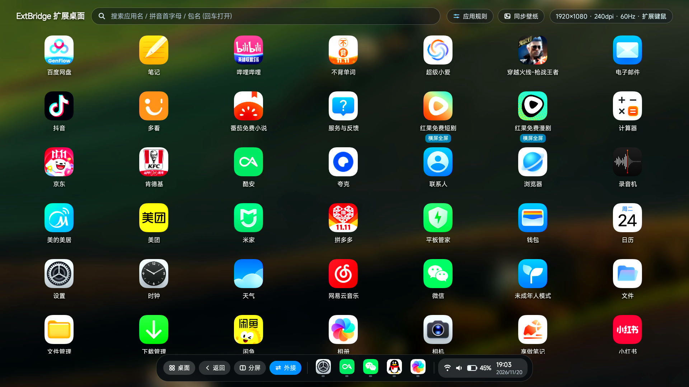 | 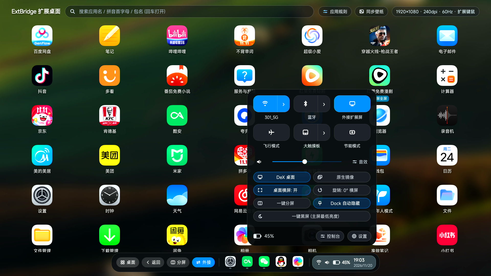 | 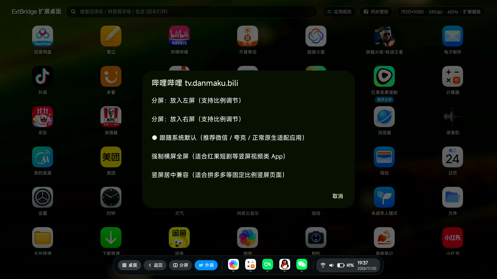 |

| 自由分屏与 `3:7~7:3` 比例控制气泡 | `70:30` 非对称分屏与左右互换 | `90°` 竖屏满幅旋转桌面（应用无感迁移） |
| :---: | :---: | :---: |
| 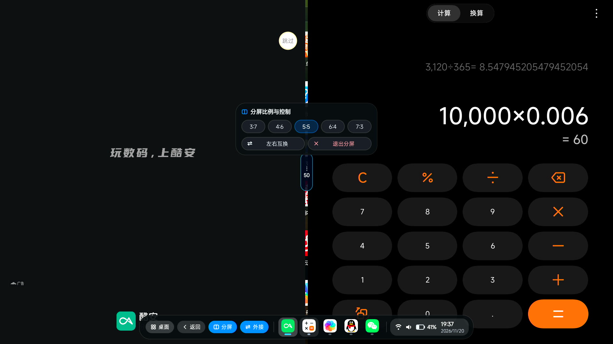 | 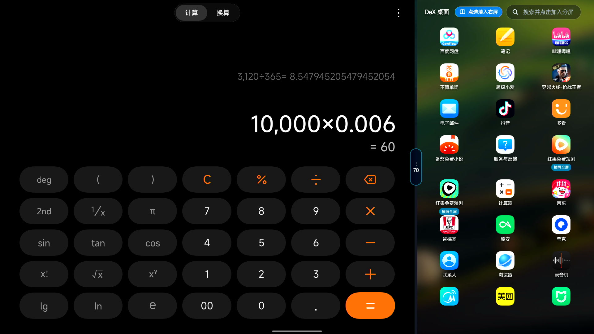 | 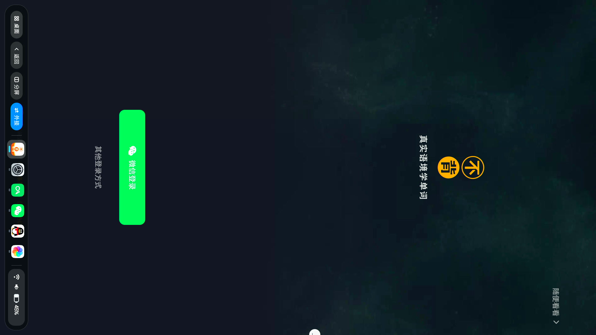 |

### 2. 增强原生镜像副屏：多布局 · 主题换肤 · 系统小组件 · 跨屏鼠标

| 晨雾浅白 · 右侧合并宽边栏 + 网易云小组件 | 极夜深蓝主题换肤 | 赛博紫青主题换肤 |
| :---: | :---: | :---: |
| 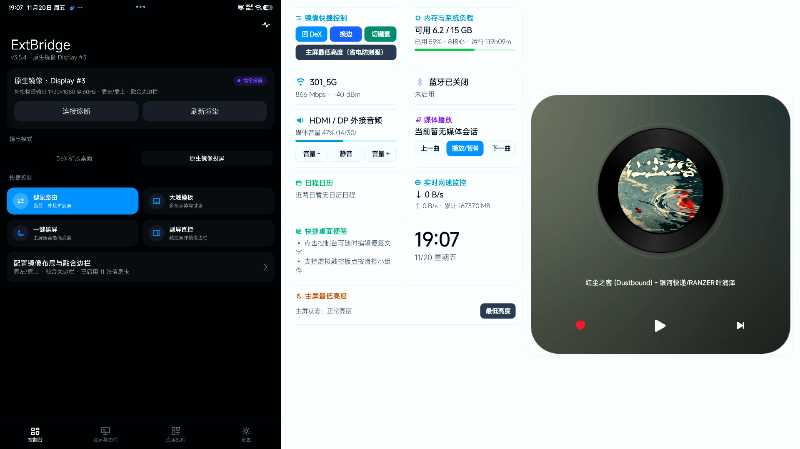 | 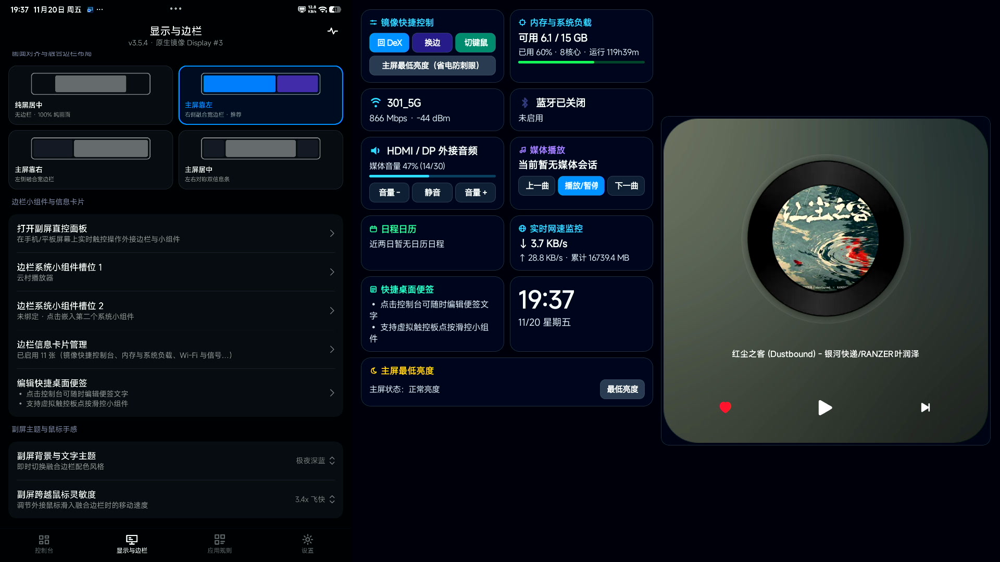 | 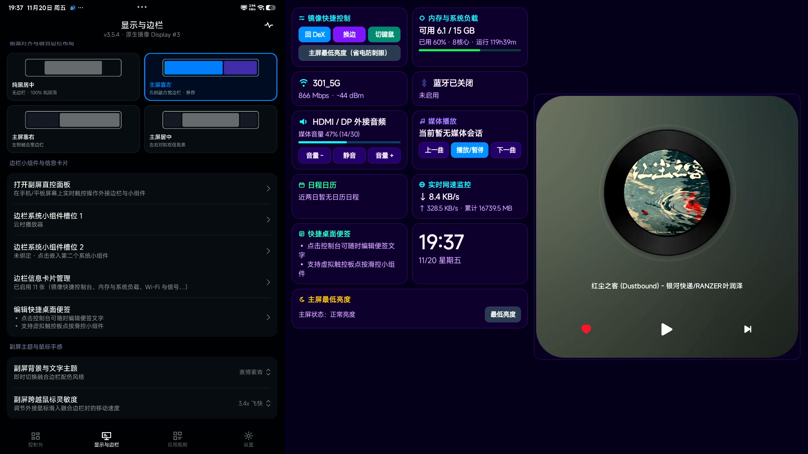 |

| 镜像右移 · 左侧合并宽边栏 | 镜像居中 · 左右双翼对称侧边栏 | 跨屏鼠标进入副屏操作小组件（防跳针） |
| :---: | :---: | :---: |
| 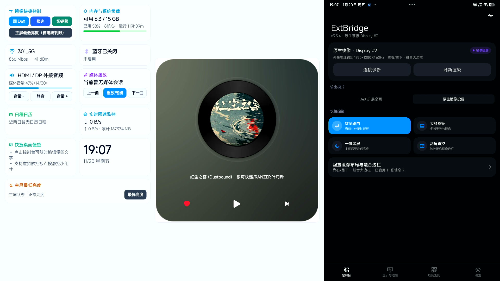 | 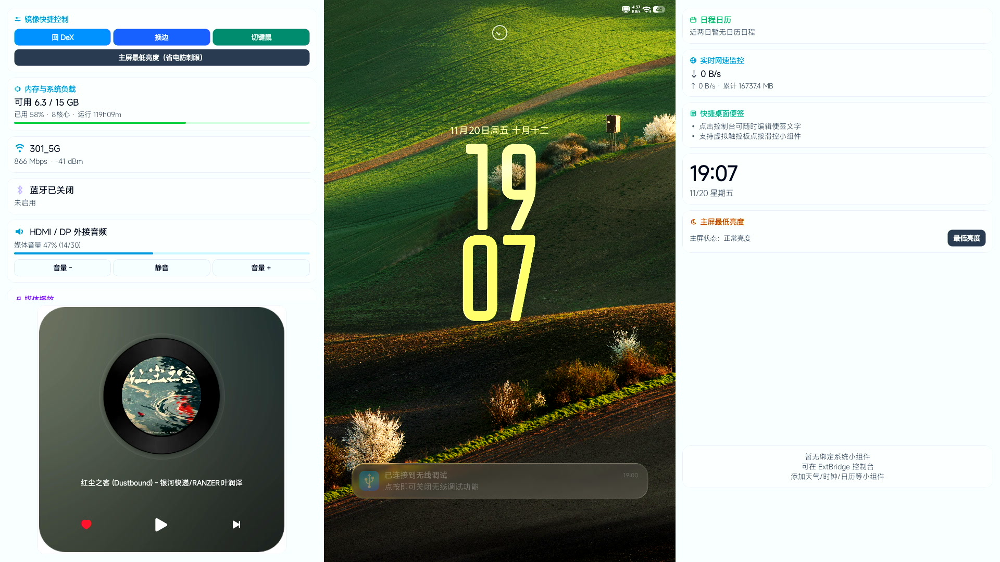 | 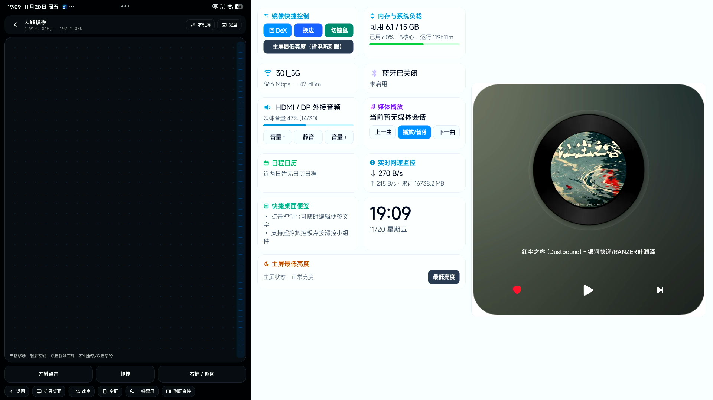 |

### 3. Miuix 增强大触摸板（含软键盘直达）、主屏「副屏直控」与一键黑屏省电

| Miuix 增强大触摸板 & 软键盘文字转发 | 主屏「副屏镜像直控」（无键鼠手指操控副屏） | 主屏「一键黑屏」最低亮度防误触遮罩 |
| :---: | :---: | :---: |
| 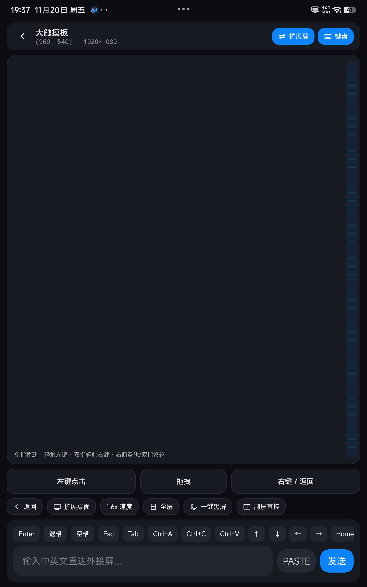 | 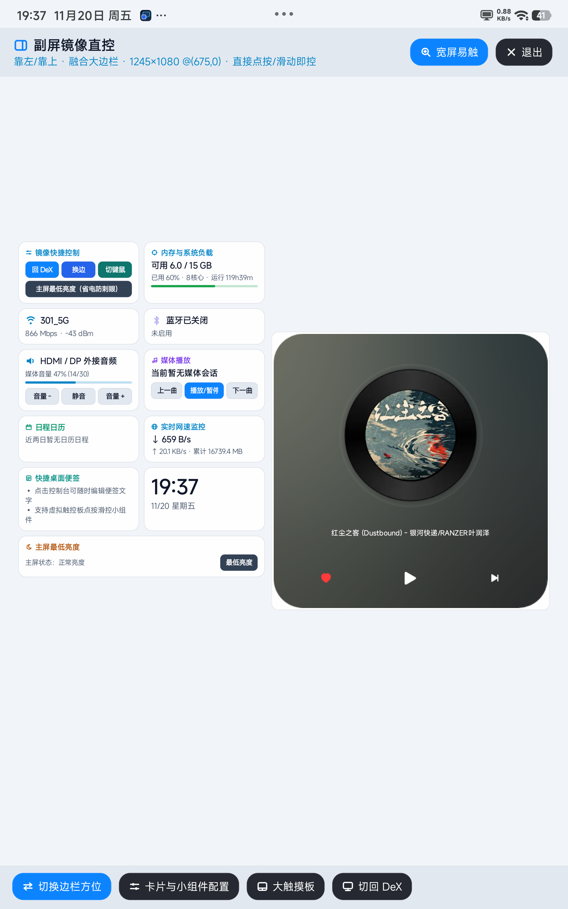 |  |
